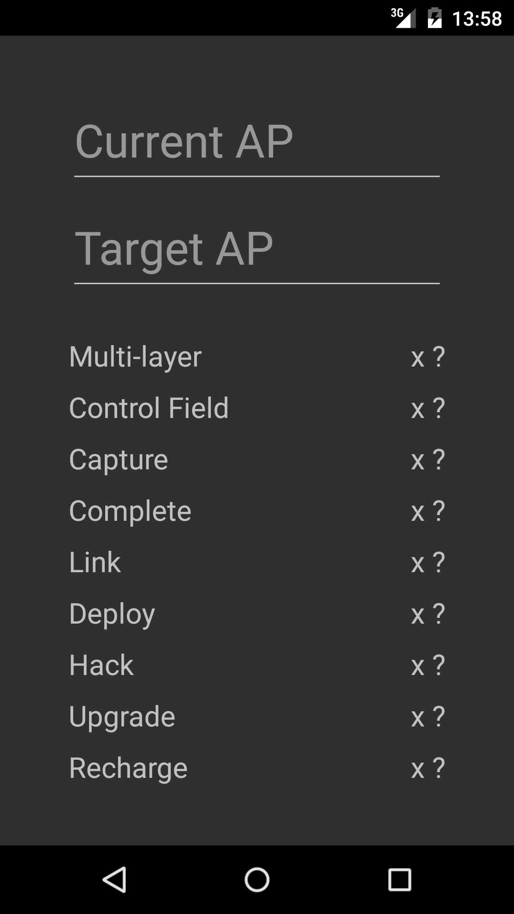
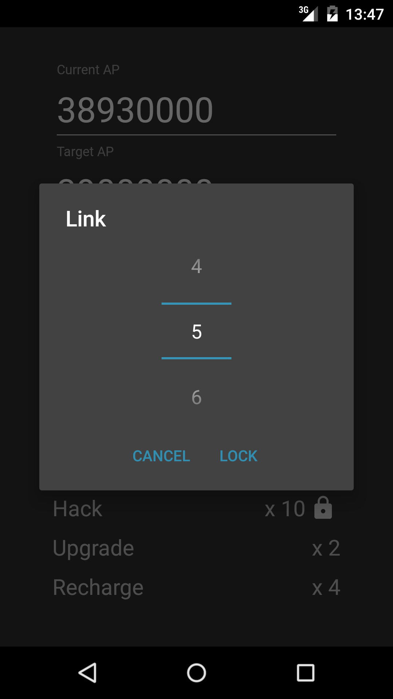
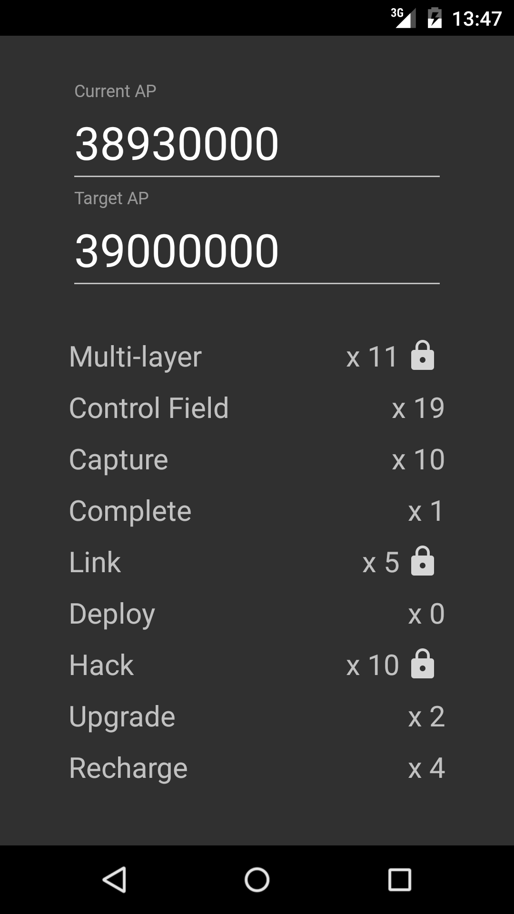
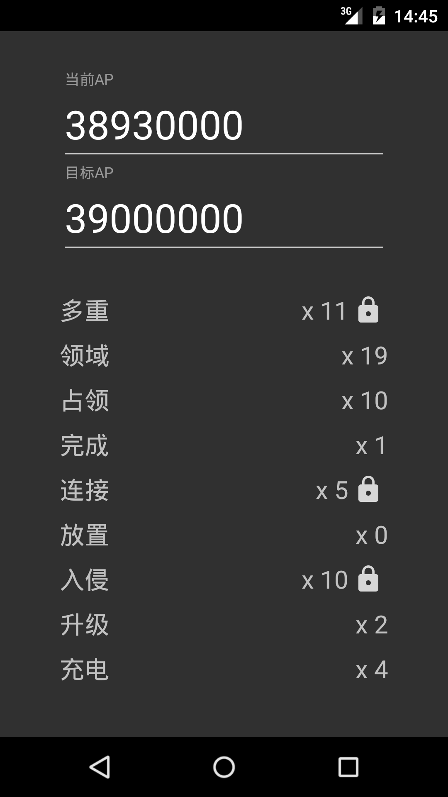

# ExactAP  
  
Get an exact number of AP in Ingress.  
在Ingress中凑出指定的AP。
  
----
  
#### Google Play  
Get **<a href="https://play.google.com/store/apps/details?id=com.m39.exactap" target="_blank">ExactAP</a>** on Google Play  
在Google Play中获取 **<a href="https://play.google.com/store/apps/details?id=com.m39.exactap" target="_blank">ExactAP</a>**  
  
----
  
####Screen Shot  
    
    

####截图
    
    
  
----
  
####Donate  
Make an App takes time, publish an App costs money (developer account fee).  
**ExactAP** is completely free, and is open-sourced with MIT License.  
I'd appreciate it a lot if you are willing to donate any amount to me！  
  
> Paypal  

<form action="https://www.paypal.com/cgi-bin/webscr" method="post" target="_top">
<input type="hidden" name="cmd" value="_xclick">
<input type="hidden" name="business" value="550111434@qq.com">
<input type="hidden" name="item_name" value="[Support 39M]39M appreciate your donation!">
<input type="hidden" name="amount" value="">
<input type="hidden" name="currency_code" value="USD">
<input type="image" src="https://www.paypal.com/en_US/i/btn/btn_donate_LG.gif" border="0"  style="border:0px;background:none;" name="submit" alt="PayPal - The safer, easier way to pay online">
</form>

  
####捐赠  
开发App消耗时间，发布App花费金钱（开发者账户费用）。  
**ExactAP**完全免费，并且以MIT许可协议开源。  
如果你愿意向我捐赠（任何金额），我会非常感激！  
  
> 支付宝  
> 
  
